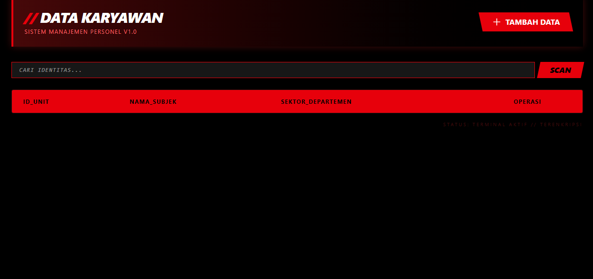

# 🔴 SISTEM MANAJEMEN PERSONEL V1.0

Sistem manajemen data personel berbasis **Laravel 12** yang dirancang dengan estetika *Cyber-Noir* dan *High-Contrast Dark Mode*. Proyek ini merupakan implementasi tingkat lanjut dari *Eloquent ORM* dan *Relational Database*.

---

## 📸 Tampilan Antarmuka


---

## 🚀 Fitur Utama
* **Full CRUD Lifecycle**: Protokol lengkap untuk penambahan, modifikasi, dan penghapusan data subjek.
* **Neural Search Engine**: Fitur pencarian identitas melalui pemindaian database secara real-time.
* **Data Pagination**: Optimasi pemuatan data skala besar untuk menjaga stabilitas memori.
* **Geometric Custom UI**: Antarmuka kustom menggunakan Tailwind CSS v4, menghindari penggunaan *template* standar.

---

## 🛠️ Stack Teknologi
* **Core**: PHP 8.2 & Laravel 12
* **Database**: MySQL (Relational Mapping via Eloquent)
* **Styling**: Tailwind CSS (Custom Implementation)
* **Environment**: Linux Ubuntu / Windows (Thinkpad X260 Optimized)

---

## ⚡ Instalasi Sistem

Ikuti langkah-langkah berikut untuk menginisialisasi terminal di lingkungan lokal Anda:

1. **Clone Repositori**
   ```bash
   git clone [https://github.com/Megasapling/nama-repo-anda.git](https://github.com/Megasapling/nama-repo-anda.git)
   cd nama-repo-anda
